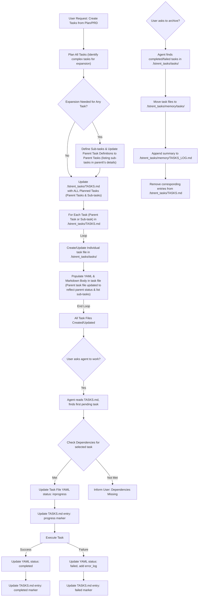

# Hanx Planners Workflow Diagram

Below is the workflow diagram for the Hanx Planners system, illustrating the process of task creation, execution, and archival.

```mermaid
graph TD
    A[User Request: Create Tasks from Plan/PRD] --> B["Plan All Tasks (Identify complex tasks for expansion)"];
    B --> B1{Expansion Needed for Any Task?};
    B1 -- Yes --> B2["Define Sub-tasks & Update Parent Task Definitions to Parent Tasks (listing sub-tasks in parent\'s details)"];
    B1 -- No --> C;
    B2 --> C["Update .fstrent_tasks/TASKS.md with ALL Planned Tasks (Parent Tasks & Sub-tasks)"];
    C --> D["For Each Task (Parent Task or Sub-task) in .fstrent_tasks/TASKS.md"];
    D -- Loop --> E[Create/Update Individual task file in .fstrent_tasks/tasks/];
    E --> F["Populate YAML & Markdown Body in task file (Parent task file updated to reflect parent status & list sub-tasks)"];
    F -- End Loop --> G[All Task Files Created/Updated];
    G --> H{User asks agent to work?};
    H -- Yes --> I[Agent reads TASKS.md, finds first pending task];
    I --> J{Check Dependencies for selected task};
    J -- Met --> K[Update Task File YAML status: inprogress];
    K --> L[Update TASKS.md entry: progress marker];
    L --> M[Execute Task];
    M -- Success --> N[Update YAML status: completed];
    N --> O[Update TASKS.md entry: completed marker];
    M -- Failure --> P["Update YAML status: failed, add error_log"];
    P --> Q[Update TASKS.md entry: failed marker];
    J -- Not Met --> R[Inform User: Dependencies Missing];
    S{User asks to archive?} --> T[Agent finds completed/failed tasks in .fstrent_tasks/tasks/];
    T --> U[Move task files to .fstrent_tasks/memory/tasks/];
    U --> V[Append summary to .fstrent_tasks/memory/TASKS_LOG.md];
    V --> W[Remove corresponding entries from .fstrent_tasks/TASKS.md];
```
